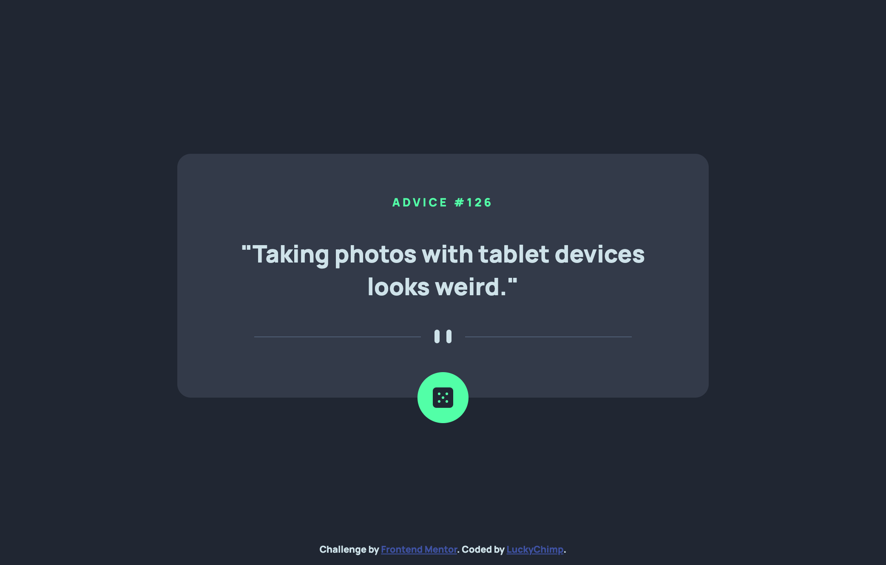

# Frontend Mentor - Advice generator app solution

This is a solution to the [Advice generator app challenge on Frontend Mentor](https://www.frontendmentor.io/challenges/advice-generator-app-QdUG-13db). Frontend Mentor challenges help you improve your coding skills by building realistic projects.

## Table of contents

- [Overview](#overview)
  - [The challenge](#the-challenge)
  - [Screenshot](#screenshot)
  - [Link](#link)
- [Built with](#built-with)
- [Author](#author)

## Overview

### The challenge

Users should be able to:

- Generate a new piece of advice by clicking the dice icon
- View the optimal layout for the app depending on their device's screen size
- See hover states for all interactive elements on the page

### Screenshot

### Link

- Solution URL: [https://luckychimp.github.io/advice-generator/](https://luckychimp.github.io/advice-generator/)

## Built with

- Semantic HTML5 markup
- SCSS for clean, easy and less CSS
- Flexbox

## Author

- Frontend Mentor - [@LuckyChimp](https://www.frontendmentor.io/profile/LuckyChimp)

